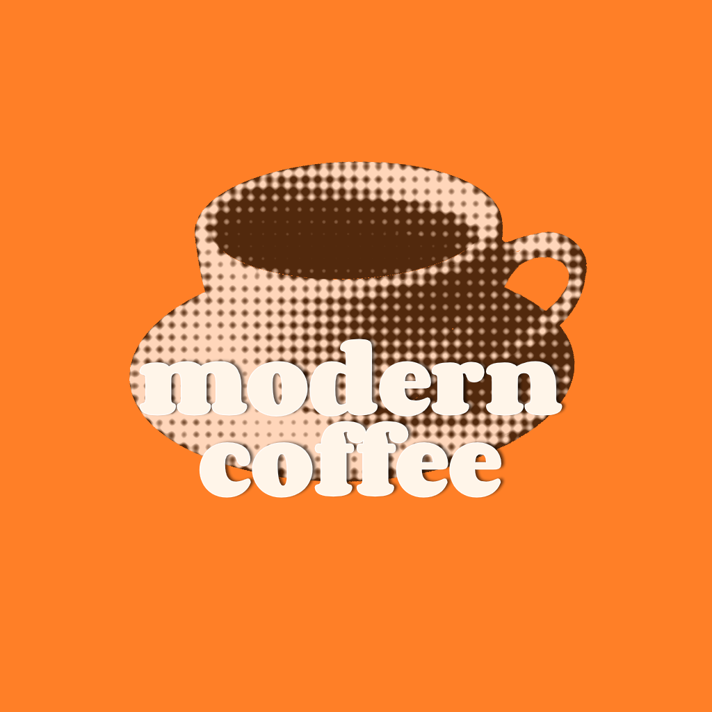
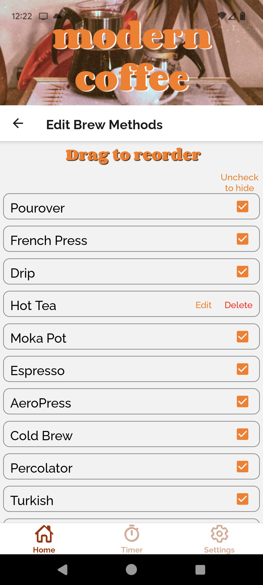
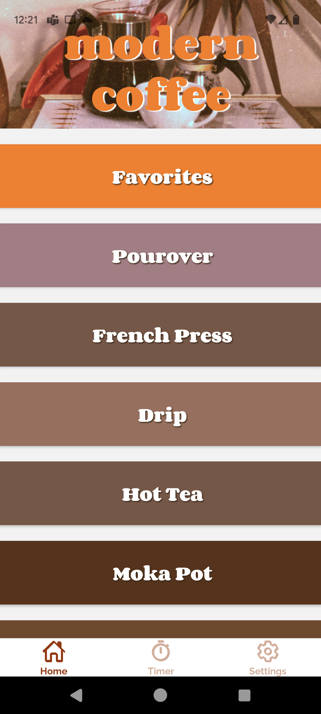

# Modern Coffee

A coffee recipe app that lets you build, store, and tweak your own brewing playbook.



## Features

- **Create and edit recipes** — Build coffee recipes from your own template of variables and refine them any time.
- **Pre-loaded brew methods** — Comes with dozens of built-in brew methods, including Pourover, French Press, Drip, Moka Pot, Espresso, AeroPress, Cold Brew, and Percolator.
- **Pre-loaded recipes** — Ships with ready-to-brew default recipes so you can start brewing immediately.
- **Customizable brew methods** — Add your own brewing methods, reorder them by dragging, hide the ones you don't use, and delete the ones you create.
- **Customizable recipe template** — Choose which variables appear in your recipes, add your own, reorder them, and hide the rest. Track everything from grinder, grind size, and water temperature to bloom, agitation, and milk type.
- **Favorites** — Star the recipes you love and pull them up instantly from the Favorites screen.
- **Featured Recipes** — A rotating showcase of favorites, toggleable from Settings.
- **Built-in timer** — Brew timers right in the app, with a selection of alarm sounds to choose from.
- **Fully offline** — All of your recipes and settings are stored locally on your device, so no account and no internet connection required.

<p>
  
  
</p>

## Getting Started

Requires an Expo-based React Native development environment.

```bash
npm install
npm start
```
